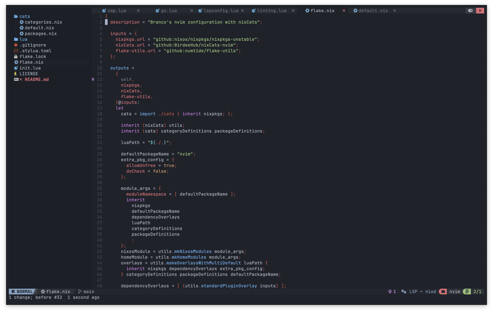

# ❄️ Neovim config



Try it out

```bash
nix run 'github:brancobruyneel/nvim'
```

## TODO

- [x] refactor loading plugins with `lze`
- [ ] fix neotest
- [ ] debugger setup
- [ ] fix auto pairs
- [ ] ai setup
- [ ] different categories e.g min, dev, etc
- [ ] devShell
- [ ] non nix support with nixUtils
- [ ] snippets

### Plugins

- [ ] mini.nvim
- [ ] oil.nvim
- [ ] diffview.nvim
- [ ] grapple.nvim
- [ ] avante.nvim
- [ ] nvim-coverage
